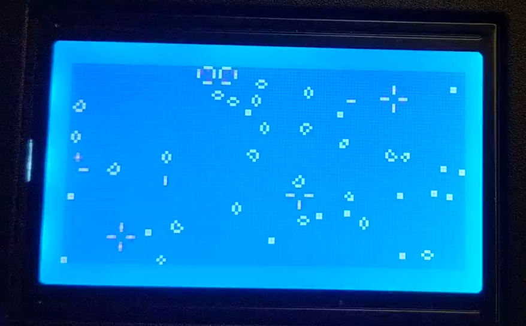

# gol-bluepill-12864
Conway's Game of Life implemented with the STM32F103 Bluepill, LibOpenCM3, and the 12864 LCD Screen

If you find yourself with an Ender3 LCD screen because you use a nicer controller board;
grab a Blue Pill (STM32F103) and some wires and turn it into a mesmerizing art project.

## Features
- Rotary Encoder speed increase/decrease
- Button press to randomize the board

## Pinout
** Your pinout might be different   
Connections
| Purpose | STM32 Pin | LCD EXP3 Pin |
|-|-|-|
| GND | GND | 9 |
| 5V | 5V | 10 |
| SCK | PA5 | 6 |
| COPI | PA7 | 8 |
| Button | PB1 |2  |
| Encoder A | PB10 | 5 |
| Encoder B | PB11 | 3 |

LCD 12864 EXP3 Pinout looking from the back of the display
|| |█| | |
|-|-|-|-|-|
|9|7|5|3|1|
|10|8|6|4|2|
